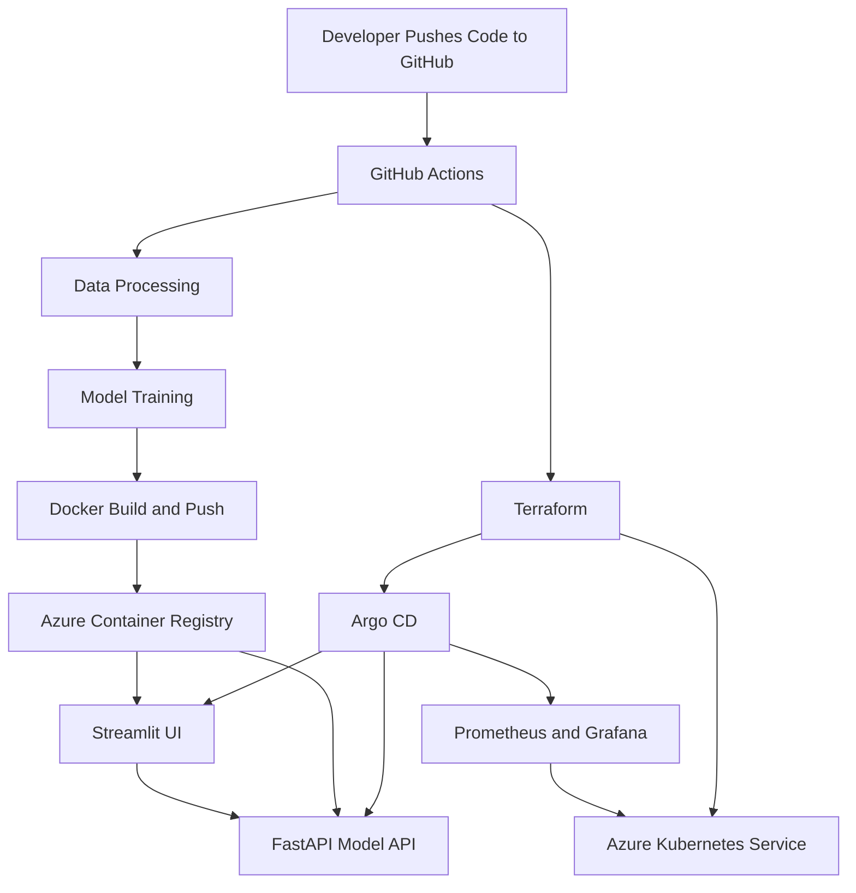

# House Price Predictor – MLOps on Azure Kubernetes Service


## Overview

This project shows how to build and deploy a machine learning application on **Azure Kubernetes Service (AKS)** using **MLOps, Terraform, GitHub Actions, Argo CD, Azure Container Registry, Prometheus, and Grafana**.

The application predicts house prices using a trained ML model. It includes a **FastAPI backend** for model inference and a **Streamlit UI** for user interaction.

The goal of this project is to demonstrate a practical end-to-end MLOps workflow:

```text
ML Model → Docker Image → Azure Container Registry → AKS → Argo CD → Monitoring
```

---

## Architecture



---

## Project Flow

```text
Data Processing
      ↓
Model Training
      ↓
Docker Build and Push to ACR
      ↓
AKS Deployment using Terraform
      ↓
Argo CD GitOps Deployment
      ↓
Monitoring with Prometheus and Grafana
```

---

## Main Components

| Component                | Purpose                                                  |
| ------------------------ | -------------------------------------------------------- |
| Python                   | Data processing, feature engineering, and model training |
| FastAPI                  | Serves the trained ML model as an API                    |
| Streamlit                | Provides a simple web UI                                 |
| Docker                   | Packages FastAPI and Streamlit applications              |
| Azure Container Registry | Stores container images                                  |
| Azure Kubernetes Service | Runs the application workloads                           |
| Terraform                | Provisions AKS and platform components                   |
| GitHub Actions           | Automates CI/CD pipeline                                 |
| Argo CD                  | Deploys Kubernetes manifests using GitOps                |
| Prometheus               | Collects metrics                                         |
| Grafana                  | Displays monitoring dashboards                           |
| HPA / VPA / KEDA         | Supports autoscaling patterns                            |

---

## Repository Structure

```text
house-price-predictor/
├── configs/                 # Model configuration
├── data/                    # Raw and processed data
├── deployment/
│   ├── kubernetes/          # FastAPI, Streamlit, service, and KEDA manifests
│   ├── monitoring/          # VPA and ServiceMonitor manifests
│   └── mlflow/              # Local MLflow setup
├── models/                  # Trained model artifacts
├── notebooks/               # Optional notebooks
├── src/
│   ├── api/                 # FastAPI application
│   ├── data/                # Data processing code
│   ├── features/            # Feature engineering code
│   └── models/              # Model training code
├── streamlit_app/           # Streamlit frontend
├── terraform/               # AKS, Argo CD, and platform infrastructure
├── Dockerfile               # FastAPI Docker image
├── requirements.txt
└── README.md
```

---

## Azure Resources

Example lab resources used for this project:

```text
Resource Group: lab2026
AKS Cluster: ai-workload
ACR Name: labopsACR2025
ACR Login Server: ACRname.azurecr.io
```

Container images:

```text
labopsacr2025.azurecr.io/house-price-model:latest
labopsacr2025.azurecr.io/house-price-streamlit:latest
```

---

## Prerequisites

Install the following tools:

```bash
git
python3.11
docker
az
kubectl
terraform
helm
```

Azure permissions required:

```text
Contributor access on AKS resource group
AcrPush access on Azure Container Registry
Storage Blob Data Contributor access for Terraform state
GitHub Actions OIDC federated credential
```

---

## Local Setup

Clone the repository:

```bash
git clone https://github.com/codefob/house-price-predictor.git
cd house-price-predictor
```

Create and activate a Python virtual environment:

```bash
python -m venv .venv
source .venv/bin/activate
```

Install dependencies:

```bash
pip install --upgrade pip
pip install -r requirements.txt
```

---

## Model Workflow

### 1. Data Processing

```bash
python src/data/run_processing.py \
  --input data/raw/house_data.csv \
  --output data/processed/cleaned_house_data.csv
```

### 2. Feature Engineering

```bash
python src/features/engineer.py \
  --input data/processed/cleaned_house_data.csv \
  --output data/processed/featured_house_data.csv \
  --preprocessor models/trained/preprocessor.pkl
```

### 3. Model Training

```bash
python src/models/train_model.py \
  --config configs/model_config.yaml \
  --data data/processed/featured_house_data.csv \
  --models-dir models
```

Expected output:

```text
models/trained/house_price_model.pkl
models/trained/preprocessor.pkl
```

---

## Run FastAPI Locally

Start FastAPI:

```bash
uvicorn src.api.main:app --host 0.0.0.0 --port 8000
```

Health check:

```bash
curl http://localhost:8000/health
```

Example prediction request:

```bash
curl -X POST "http://localhost:8000/predict" \
  -H "Content-Type: application/json" \
  -d '{
    "sqft": 1500,
    "bedrooms": 3,
    "bathrooms": 2,
    "location": "suburban",
    "year_built": 2000,
    "condition": "fair"
  }'
```

---

## Run Streamlit Locally

```bash
cd streamlit_app
streamlit run app.py
```

Open:

```text
http://localhost:8501
```

---

## Docker Build

Build FastAPI image:

```bash
docker build -t house-price-model:local .
```

Build Streamlit image:

```bash
docker build -t house-price-streamlit:local ./streamlit_app
```

---

## GitHub Actions Pipeline

The pipeline runs automatically when code is pushed to the `main` branch.

```text
data-processing
      ↓
model-training
      ↓
Docker_build-and-publish_ACR
      ↓
Deploy_to_AKS_with_Terraform
      ↓
argocd-deploy
```

Pipeline responsibilities:

| Job                            | Description                            |
| ------------------------------ | -------------------------------------- |
| `data-processing`              | Cleans and prepares data               |
| `model-training`               | Trains the ML model                    |
| `Docker_build-and-publish_ACR` | Builds and pushes Docker images to ACR |
| `Deploy_to_AKS_with_Terraform` | Deploys AKS and platform components    |
| `argocd-deploy`                | Deploys applications using Argo CD     |

---

## Azure Container Registry

Verify repositories in ACR:

```bash
az acr repository list \
  --name labopsACR2025 \
  -o table
```

Expected repositories:

```text
house-price-model
house-price-streamlit
```

Check image tags:

```bash
az acr repository show-tags \
  --name labopsACR2025 \
  --repository house-price-model \
  -o table

az acr repository show-tags \
  --name labopsACR2025 \
  --repository house-price-streamlit \
  -o table
```

---

## Terraform

Terraform is used to manage:

* AKS cluster
* Node pools
* ACR pull permissions
* Cluster autoscaler settings
* Argo CD installation
* Argo CD application bootstrap

Run local validation:

```bash
cd terraform
terraform init -backend=false -upgrade
terraform fmt
terraform validate
```

Run Terraform plan:

```bash
terraform plan \
  -var="create_aks=true" \
  -var="acr_name=labopsACR2025" \
  -var="acr_resource_group_name=lab2025"
```

---

## Argo CD

Argo CD is installed by Terraform using the Helm provider.

Connect to AKS:

```bash
az aks get-credentials \
  --resource-group lab2026 \
  --name ai-workload \
  --overwrite-existing
```

Check Argo CD resources:

```bash
kubectl get pods -n argocd
kubectl get svc -n argocd
kubectl get applications -n argocd
```

Get Argo CD admin password:

```bash
kubectl get secret argocd-initial-admin-secret \
  -n argocd \
  -o jsonpath="{.data.password}" | base64 -d; echo
```

Access Argo CD:

```text
http://<argocd-external-ip>
```

Login:

```text
Username: admin
Password: <password from command>
```

---

## Application Deployment

Application manifests are stored in:

```text
deployment/kubernetes/
```

Argo CD deploys:

* FastAPI model API
* Streamlit UI
* Kubernetes services
* KEDA ScaledObject

Check application pods:

```bash
kubectl get pods -n default
```

Check services:

```bash
kubectl get svc -n default
```

Access Streamlit:

```bash
kubectl get svc streamlit -n default
```

Open:

```text
http://<streamlit-external-ip>
```

---

## Monitoring

Monitoring manifests are stored in:

```text
deployment/monitoring/
```

Monitoring stack includes:

* Prometheus
* Grafana
* ServiceMonitor
* Vertical Pod Autoscaler recommendations

Check monitoring resources:

```bash
kubectl get pods -n monitoring
kubectl get svc -n monitoring
kubectl get servicemonitor -A
kubectl get vpa -A
```

Access Grafana:

```bash
kubectl get svc -n monitoring
```

Open:

```text
http://<grafana-external-ip>
```

For production use, store Grafana credentials in a secure secret store instead of hardcoding them.

---

## Autoscaling

This project includes multiple autoscaling options:

| Autoscaler         | Purpose                                     |
| ------------------ | ------------------------------------------- |
| HPA                | Scales pods horizontally                    |
| VPA                | Provides CPU and memory recommendations     |
| KEDA               | Supports event-driven scaling               |
| Cluster Autoscaler | Scales AKS nodes based on scheduling demand |

Useful commands:

```bash
kubectl get hpa -A
kubectl get vpa -A
kubectl get scaledobject -A
kubectl get nodes
kubectl get events -A --sort-by=.lastTimestamp
```

---

## Troubleshooting

### ImagePullBackOff

Check pod details:

```bash
kubectl describe pod <pod-name> -n default
```

Verify ACR repositories:

```bash
az acr repository list \
  --name labopsACR2025 \
  -o table
```

Expected:

```text
house-price-model
house-price-streamlit
```

Verify AKS has ACR pull access:

```bash
az role assignment list \
  --scope $(az acr show --name labopsACR2025 --resource-group lab2025 --query id -o tsv) \
  --role AcrPull \
  -o table
```

### Argo CD Sync Issue

```bash
kubectl get applications -n argocd
kubectl describe application <application-name> -n argocd
```

### Streamlit Not Accessible

```bash
kubectl get svc -n default
kubectl get pods -n default
```

### Grafana Not Accessible

```bash
kubectl get svc -n monitoring
kubectl get pods -n monitoring
```

---

## Security Notes

This project is designed as a lab and learning environment. Before using this pattern in production, consider:

* Use private AKS networking
* Use private ACR endpoints
* Store secrets in Azure Key Vault or External Secrets
* Enable TLS for public endpoints
* Avoid hardcoded admin passwords
* Restrict public LoadBalancer access
* Use GitHub OIDC instead of long-lived credentials
* Enable image scanning and policy controls

---

## Project Goal

The goal of this project is to demonstrate a simple and practical MLOps workflow on Azure:

```text
ML Model → Docker → ACR → AKS → Argo CD → Monitoring
```

It shows how cloud, DevOps, Kubernetes, GitOps, and MLOps can work together to deploy a machine learning workload in a modern platform engineering workflow.
